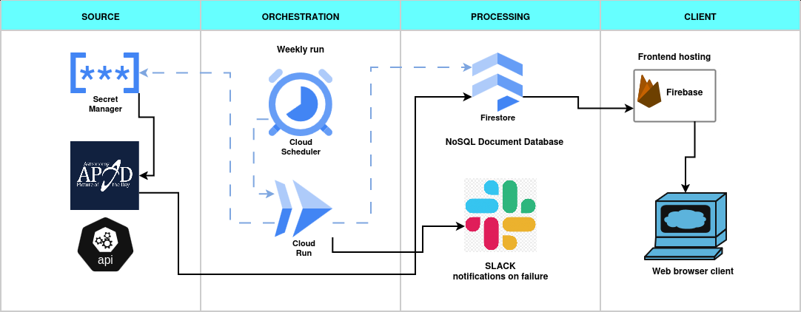
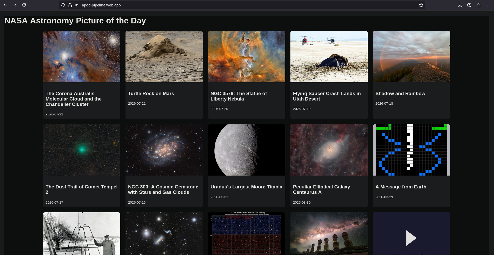
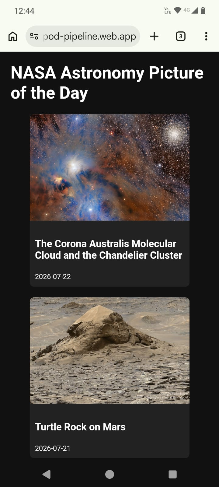

# NASA APOD Data Pipeline


An automated pipeline that extracts, normalizes, and stores NASA's **Astronomy Picture of the Day** (APOD) data and exposes it through a responsive web gallery accessible from any device.

Built entirely on Google Cloud's free tier, this project showcases a production-oriented data engineering workflow featuring fault-tolerant extraction, advanced data cleaning, idempotent loading into Firestore, orchestration with Cloud Run and Cloud Scheduler, secret management with Secret Manager, and a lightweight frontend hosted on Firebase Hosting.

---

## Architecture

```text
[GCP] Cloud Scheduler (every Monday at 6:00 AM UTC)
                |
                v
[GCP] Cloud Run (Flask + gunicorn)
                |
                |-- Extracts data (NASA API with backoff)
                |-- Transforms and normalizes data
                |-- Loads data into Firestore (upsert)
                |-- Updates control document
                |-- Sends email alerts on failure (SendGrid)
                v
[GCP] Firestore (collection `apod`)
                |
                v
[Firebase Hosting] Vanilla JS Frontend (direct Firestore reads)
```

## Technology Stack

| Category | Technology |
|---------|---------|
| Orchestration | Cloud Scheduler + Cloud Run |
| Database | Firestore (Native Mode) |
| Secrets Management | Secret Manager |
| Notifications | SendGrid |
| Frontend | Firebase Hosting + Firestore SDK |
| Testing | Pytest |
| Containers | Docker |
| CI/CD | Cloud Build |

### Repository Structure

```text
nasa-apod-pipeline/
├── .github/workflows/ci.yml      # Continuous Integration
├── pipeline/                     # Pipeline source code
│   ├── main.py                   # Cloud Run entrypoint
│   ├── extract.py                # API calls with retries
│   ├── transform.py              # Data cleaning and normalization
│   ├── load.py                   # Firestore loading logic
│   ├── utils.py                  # Logging and email utilities
│   ├── requirements.txt
│   └── Dockerfile
├── frontend/index.html           # Web gallery (HTML + Vanilla JS)
├── config/
│   ├── .env.example              # Required environment variables
│   └── firestore.rules           # Security rules
├── docs/design.md                # Detailed design document
├── tests/test_transform.py       # Unit tests
├── scripts/deploy.sh             # Deployment commands
└── README.md
```

---

## Deployment from Scratch

### 1. Clone the repository and install dependencies

```bash
git clone https://github.com/Mauriljb/nasa-apod-pipeline.git
cd nasa-apod-pipeline
python -m venv env && source env/bin/activate
pip install -r pipeline/requirements.txt
```

### 2. Configure environment variables

Copy `.env.example` to `.env` and fill in the required values:

```env
NASA_API_KEY=your-api-key
GOOGLE_CLOUD_PROJECT=your-gcp-project-id
SENDGRID_API_KEY=your-sendgrid-key
TO_EMAIL=your@email.com
FROM_EMAIL=pipeline@example.com
```

### 3. Run tests locally

```bash
pytest tests/ -v
```

### 4. Build the container image with Cloud Build

```bash
gcloud builds submit --tag gcr.io/primer-proyecto-103/apod-pipeline --region=global
```

### 5. Store secrets in Secret Manager

```bash
echo -n "YOUR_API_KEY" | gcloud secrets create nasa-api-key --data-file=-
gcloud secrets add-iam-policy-binding nasa-api-key \
--member="serviceAccount:apod-pipeline-sa@..." \
--role="roles/secretmanager.secretAccessor"
```

### 6. Deploy to Cloud Run

```bash
gcloud run deploy apod-pipeline \
--image gcr.io/primer-proyecto-103/apod-pipeline \
--region us-central1 \
--allow-unauthenticated \
--set-secrets="NASA_API_KEY=nasa-api-key:latest" \
--service-account=apod-pipeline-sa@...
```

### 7. Configure Cloud Scheduler

```bash
gcloud scheduler jobs create http apod-weekly \
--schedule "0 6 * * 1" \
--uri "CLOUD_RUN_URL" \
--http-method POST
```

### 8. Deploy the frontend

```bash
firebase init hosting
# Public directory: frontend
firebase deploy --only hosting
```

## Backfill and Incremental Loads

- First execution: if the control document is missing, the pipeline performs a full backfill from 2020-01-01 through yesterday, processing data in 7-day batches.
- Weekly executions: only the previous seven days are loaded, with a one-day overlap for safety.
- Idempotency: the natural key `date` (YYYY-MM-DD) guarantees that records are never duplicated.

## Data Normalization

- HTML entity decoding (`&`, `<`, etc.)
- Removal of HTML tags and residual markup
- Cleanup of line breaks and whitespace normalization
- Standardization of the `copyright` field
- Proper handling of null values and image/video differences

See `docs/design.md` for implementation details.

## Security

- NASA API key stored in Secret Manager
- Service account configured with the principle of least privilege (`datastore.user`)
- Firestore rules configured for public read-only access to the `apod` collection
- `.env` files are never versioned

## Monitoring

- Centralized logs through Cloud Logging
- Email alerts via SendGrid when failures occur (pending final activation)
- Exponential backoff retry strategy (urllib3 + application layer)

## Architecture diagram



## Frontend Screenshot

Screenshot in laptop

<p align="center">
  
</p>
Screenshot in mobile

## License

MIT License

© Mauricio L. (2026)

---

Want to run it in your own Google Cloud project? Follow the deployment steps above and replace `primer-proyecto-103` with your own GCP project ID.
