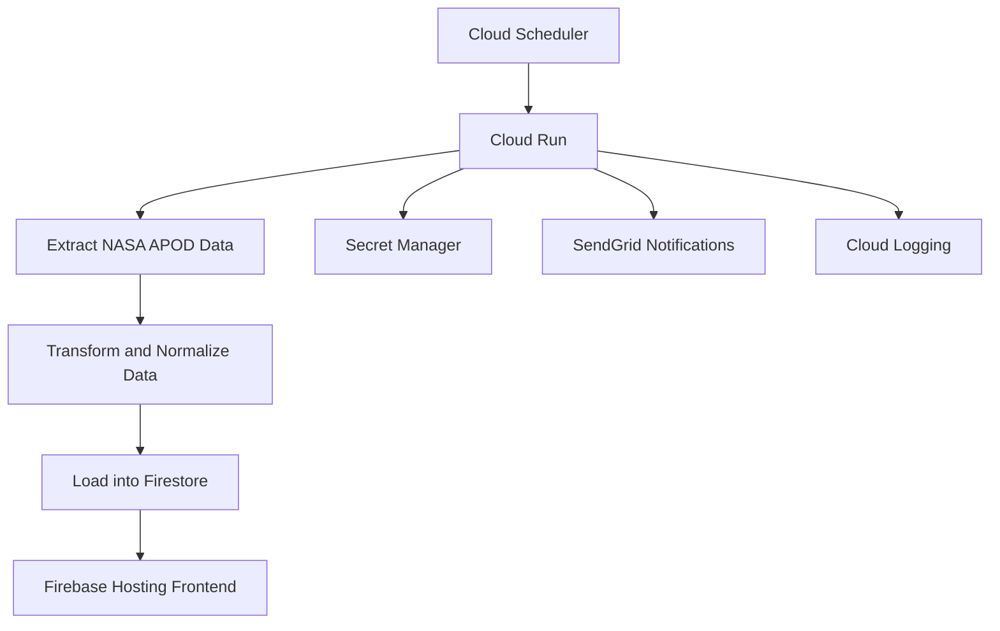

# NASA APOD Data Pipeline - Technical Design Document

**Version:** 1.1  
**Author:** Mauricio L. J. B.  
**Date:** 2026-06-28  
**Status:** Approved Design – Production Ready

---

## 1. Executive Summary

This document describes the design of a production-oriented, serverless ETL pipeline built on Google Cloud Platform that automatically ingests NASA's Astronomy Picture of the Day (APOD) dataset, performs data normalization and incremental loading, stores the information in Firestore, and exposes it through a responsive web application.

The project was intentionally designed to operate entirely within the Google Cloud free tier while following professional data engineering practices, including secure secret management, idempotent processing, retry mechanisms, logging, and failure notifications.

---

## 2. Functional Requirements

- **FR1 – Historical Backfill:** The pipeline must retrieve all APOD records from 2020-01-01 through the current date during its first execution.
- **FR2 – Weekly Incremental Loads:** After the initial load, the pipeline automatically executes every Monday at 06:00 UTC and ingests the most recent records using an overlapping extraction window.
- **FR3 – Data Normalization:** Raw API responses are cleaned and normalized before storage.
- **FR4 – Idempotency:** The natural key `date` (YYYY-MM-DD) guarantees that records are never duplicated. Upsert operations are used throughout the loading process.
- **FR5 – Remote Access:** Data is made available through a responsive web gallery accessible from any device.
- **FR6 – Notifications:** Email alerts are sent whenever extraction or processing fails after all retry attempts have been exhausted.
- **FR7 – Security:** Secrets are securely stored in Google Cloud Secret Manager and are never committed to version control.

---

## 3. Technology Stack

| Component | Technology | Justification |
|----------|----------|----------|
| Orchestration | Cloud Scheduler + Cloud Run | Fully serverless architecture with scale-to-zero capabilities. |
| Database | Firestore (Native Mode) | Document-oriented model ideal for APOD metadata and direct frontend integration. |
| Secrets Management | Secret Manager | Secure storage, auditing, and secret rotation support. |
| Notifications | SendGrid | Free tier support and easy REST API integration. |
| Frontend | Firebase Hosting + HTML/JavaScript | Free SSL-enabled static hosting with Firestore SDK integration. |
| Programming Language | Python 3.10+ | Excellent support for GCP services and JSON processing. |

---

## 4. System Architecture

---

## 5. Firestore Data Model

**Collection:** `apod`  
**Document ID:** `YYYY-MM-DD`

| Field | Type | Description |
|------|------|------|
| date | string | APOD publication date. |
| title | string | Image or video title. |
| explanation | string | Cleaned explanatory text. |
| url | string | Standard resolution image URL. |
| hdurl | string | High-definition image URL (optional). |
| media_type | string | Either `image` or `video`. |
| copyright | string | Content author or `Public Domain`. |
| thumbnail_url | string | Thumbnail URL for video entries. |
| load_timestamp | timestamp | UTC timestamp generated during ingestion. |

### Control Collection

Collection: `pipeline_state`  
Document ID: `apod_control`

| Field | Type | Description |
|------|------|------|
| last_loaded_date | string | Last successfully loaded date. |
| updated_at | timestamp | Last control document update timestamp. |

---

## 6. Data Quality Considerations

The pipeline enforces the following data quality rules:

- `date` must be unique and is used as the natural key.
- `media_type` must be either `image` or `video`.
- HTML entities and residual HTML tags are removed from text fields.
- Null and missing values are handled gracefully.
- `load_timestamp` is generated automatically during ingestion.
- `hdurl` and `thumbnail_url` are optional fields.
- Copyright values are standardized whenever possible.

---

## 7. Loading Strategy

### Historical Backfill

The initial execution performs a historical load starting from 2020-01-01.

The dataset is retrieved in seven-day batches to:

- Minimize the number of API calls.
- Simplify retry operations.
- Remain well below NASA's rate limits.
- Facilitate incremental loading strategies.

Each batch is:

1. Extracted from the NASA API.
2. Normalized and validated.
3. Upserted into Firestore.
4. Used to update the control document.

A 200 ms delay is applied between requests.

### Incremental Loads

Weekly executions:

- Run every Monday at 06:00 UTC.
- Read the `last_loaded_date` value.
- Extract records between the last loaded date and the previous day.
- Perform normalization and loading.
- Update the control document.

The overlapping extraction window guarantees complete coverage and simplifies recovery from partial failures.

---

## 8. Error Handling and Retry Strategy

The pipeline implements five retries using exponential backoff:

- 2 seconds
- 4 seconds
- 8 seconds
- 16 seconds
- 32 seconds

The following failure scenarios are considered:

- NASA API timeouts.
- HTTP 403 and HTTP 503 responses.
- JSON parsing errors.
- Firestore write failures.
- Secret Manager access failures.
- Cloud Run execution timeouts.
- Unexpected exceptions.

If all retries fail:

- Errors are logged in Cloud Logging.
- An email notification is sent through SendGrid.
- The execution terminates safely.

The pipeline guarantees document-level idempotency and can be re-executed without producing duplicate records.

---

## 9. Security Considerations

- All secrets are managed exclusively through Google Cloud Secret Manager.
- Secrets are never committed to version control.
- Cloud Run uses a dedicated service account with the minimum required permissions.
- Firestore rules provide read-only access for frontend consumption.
- Cloud Scheduler invokes Cloud Run using the appropriate IAM role.

---

## 10. Data Consumption Layer

The frontend is implemented as a static web application hosted on Firebase Hosting.

Features include:

- Responsive image gallery.
- Direct Firestore queries ordered by publication date.
- Lazy pagination support.
- Modal view for complete APOD metadata.
- Mobile-friendly design.

---

## 11. Monitoring and Logging

Cloud Run automatically exports logs to Cloud Logging.

The pipeline records:

- Execution start and completion.
- Number of records extracted and loaded.
- Retry attempts.
- Errors and exceptions.
- Control document updates.

Failure notifications include:

- Error description.
- Timestamp.
- Link to Cloud Logging resources.

---

## 12. Cost Considerations

The project was intentionally designed to run within Google Cloud's free tier.

| Service | Estimated Monthly Cost |
|--------|--------|
| Cloud Run | $0 |
| Cloud Scheduler | $0 |
| Firestore | $0 |
| Firebase Hosting | $0 |
| Secret Manager | $0 |
| SendGrid | Free Tier |

**Estimated Monthly Cost: $0 USD**

---

## 13. Project Deliverables

- Python ETL pipeline.
- Cloud Run deployment configuration.
- Cloud Scheduler configuration.
- Firestore security rules.
- Firebase Hosting frontend.
- Technical documentation.

---

## 14. Future Improvements

Potential future enhancements include:

- GitHub Actions-based CI/CD deployments.
- Additional data validation tests.
- Monitoring dashboards.
- Cloud Storage backup strategies.
- Container vulnerability scanning.
- Advanced frontend filtering capabilities.
- API layer for external consumers.

---

This project demonstrates the implementation of a production-oriented, serverless data engineering pipeline using modern Google Cloud services and industry best practices.
